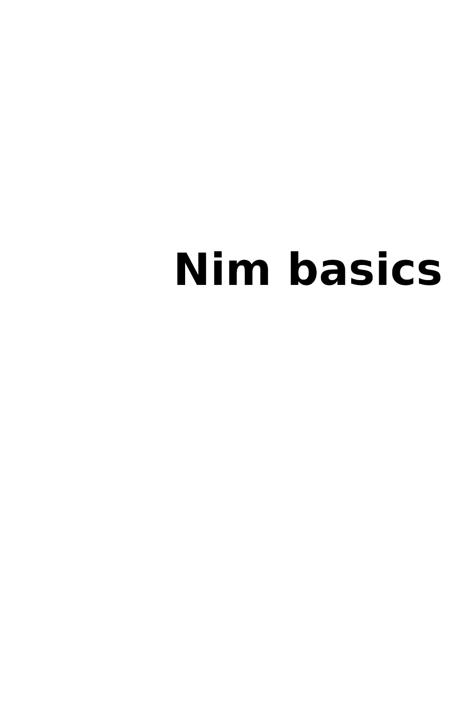

= Nim basics
:source-highlighter: rouge
:rouge-style: gruvbox
:source-language: nim
:source-dir: code
:pdf-themesdir: styles
:pdf-theme: pdf
:pdf-folio-placement: physical
:front-cover-image: 
:icons: font
:stylesheet: styles/style.css
:linkcss:
:doctype: book
:toc: left

https://nim-lang.org/[Nim] is a relatively new programming language which allows users to write easy-to-read high-performance code.
But if you are reading this Nim tutorial, the chances are that you already know about Nim.

The tutorial is available both https://narimiran.github.io/nim-basics/[online] and as a https://github.com/narimiran/nim-basics/raw/master/nim-basics.epub[book in epub format].

This is a work-in-progress: if you spot any errors and/or you have an idea how to make this tutorial better, please report it to the https://github.com/narimiran/nim-basics/issues[issue tracker].

== Who is this for?

* People with no or minimal previous programming experience
* People with some programming experience in other programming languages
* People who want to explore Nim for the first time, starting from scratch

== Who is this _not_ for?

* People with lots of programming experience: other, more advanced, tutorials might suit you better.
  See https://nim-lang.org/docs/tut1.html[Official Tutorial] or https://nim-by-example.github.io/[Nim by Example].
* People experienced in Nim (feel free to help make this tutorial better)

== How to use this tutorial?

The aim of this tutorial is to give you the basics of programming and the Nim syntax so you can have an easier time following other tutorials and/or explore further by yourself.

Instead of just reading what is written, it would be the best if you try the stuff by yourself, modify the examples, think of some examples of your own, and be curious in general.
The exercises at the end of some chapters should be non-negotiable -- don't skip them.

If you need additional help understanding some parts of the tutorial or with the exercises, you can always ask for help on the https://forum.nim-lang.org/[Nim forum], the https://gitter.im/nim-lang/Nim[Nim Gitter channel], their https://discordapp.com/invite/ezDFDw2[Discord server], or Nim's IRC channel on freenode, #nim.

include::01-installation.adoc[]

include::02-variables.adoc[]

include::03-types.adoc[]

include::04-control-flow.adoc[]

include::05-loops.adoc[]

include::06-containers.adoc[]

include::07-procedures.adoc[]

include::08-modules.adoc[]

include::09-user-input.adoc[]

include::10-conclusion.adoc[]

{nbsp}

{nbsp}

'''

{nbsp}

The source files are available https://github.com/narimiran/nim-basics[on Github].
